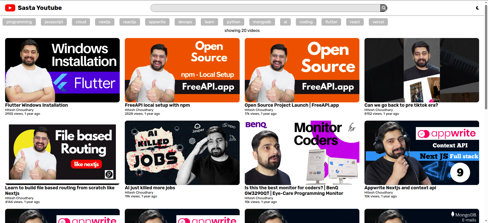
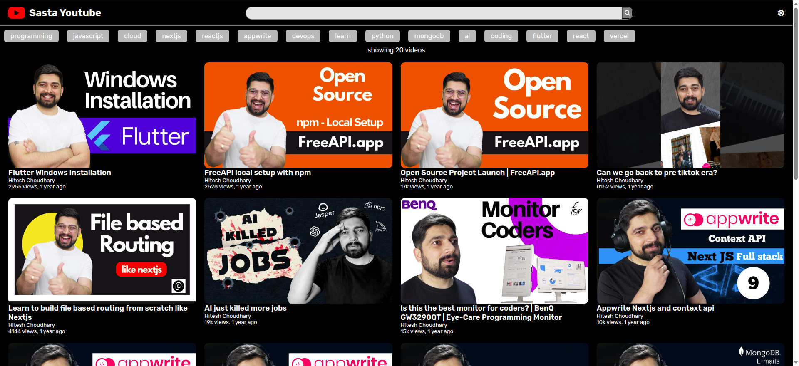
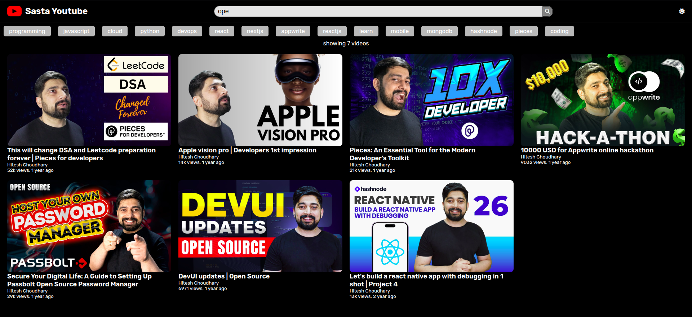
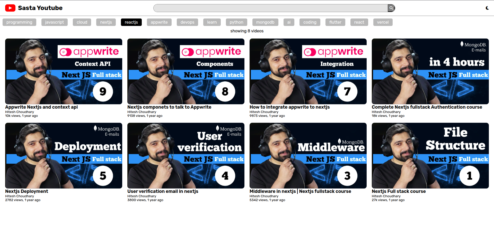
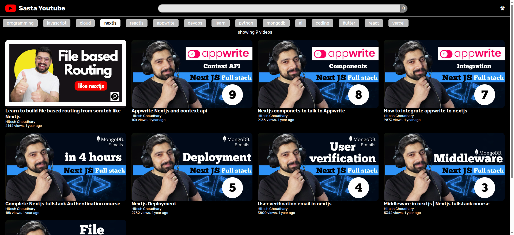
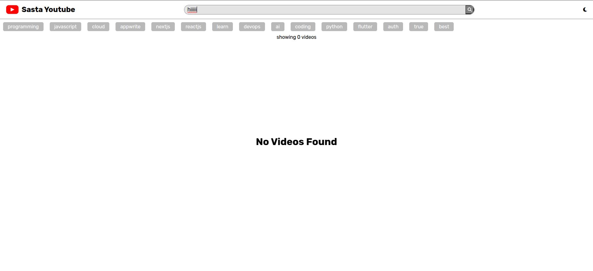

# Master Ji Assignment 2

## Sasta Youtube [Demo](https://sastayoutube.unknownbug.tech/)

A simple projects leveraging api from open source API [FreeAPI](https://freeapi.hashnode.space/api-guide/apireference/getYoutubeVideos) by fetching api [endpoint](https://api.freeapi.app/api/v1/public/youtube/videos) and displaying youtube videos on the webpage in similar way that youtube list it's videos.

---

## Features

- Lists youtube videos
- displays youtube video thumbnails,titles ,channel names, view count and time elapsed
- Every time if someone clicks on video it opens it in youtube
- A search bar that filters video according to searched query from already fetched videos
- Displays all the available tags to filter videos based on tags from already fetched video
- Auto reloader : If user goes to end of the web page it fetches more videos without telling the user
- Theme toggle from dark to light

## Screenshots

**Landing Page**

**Landing Page Dark Mode**

**Searching through query after loading 70 videos by scrolling down**

**Searching through tag**

**Searching through tag in Dark Mode**

**No videos found**

